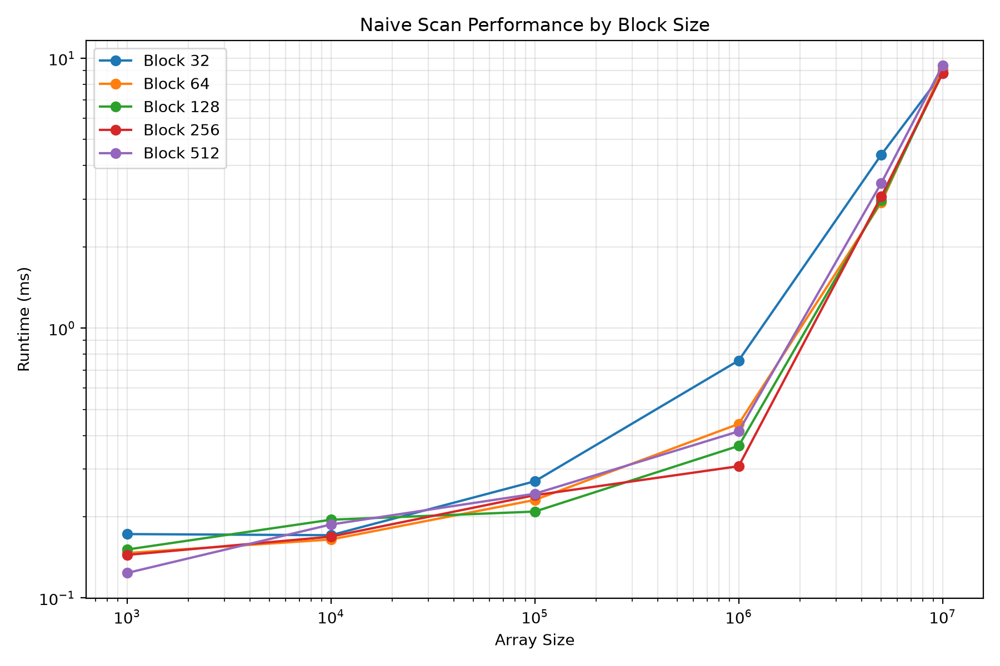
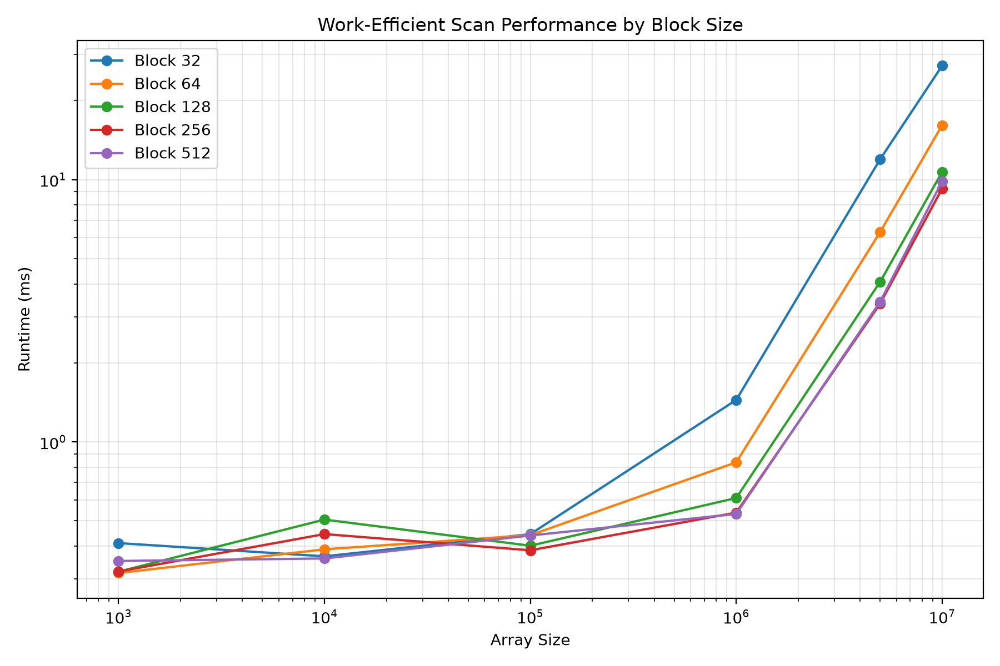
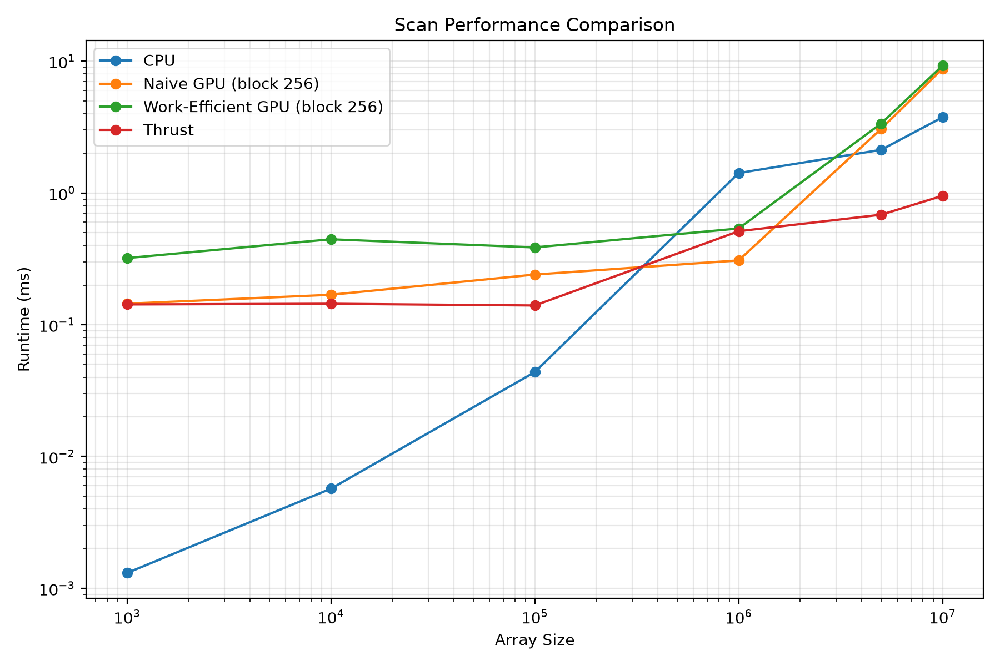

CUDA Stream Compaction
======================

**University of Pennsylvania, CIS 565: GPU Programming and Architecture, Project 2**

Thomas Lee
[https://www.linkedin.com/in/thomas-lee-6353b5253/](), [https://thomaslee03-github-io.vercel.app/]()

* Tested on: Windows 11, AMD Ryzen 9 7845HX @ 3.00 GHz, 64GB RAM, NVIDIA GeForce RTX 4070 Laptop GPU 8GB. Personal laptop. 

## Introduction

This project implements several versions of prefix sum (scan) and stream compaction on both the CPU and GPU. The main goal was to compare different scan algorithms, see how CUDA block size affects performance, and compare my implementations against NVIDIA Thrust.

The project includes a serial CPU scan, a naive CUDA scan, a work-efficient CUDA scan, and a Thrust scan.

**CPU Scan and Stream Compaction**

The CPU scan performs a serial exclusive prefix sum. I also implemented stream compaction both directly and using scan + scatter.

**Naive CUDA Scan**

The naive CUDA scan runs several passes over the array. Each pass doubles the offset used to combine values.

Because an in-place update could cause race conditions, I used two device buffers and swapped between them after each scan level.

This implementation does about $O(N \log N)$ work.

**Work-Efficient CUDA Scan**

The work-efficient scan uses an up-sweep and down-sweep.

The up-sweep builds partial sums in a tree structure. The root is then set to 0, and the down-sweep propagates the prefix sums back through the tree.

For non-power-of-two inputs, I pad the array to the next power of two.

**GPU Stream Compaction**

The GPU compaction implementation works in three main steps:

1. Map non-zero values to 1 and zero values to 0.
2. Exclusive scan the boolean array.
3. Scatter the non-zero values into their final positions.

For example:

Input:    [3, 0, 5, 0, 2]
Booleans: [1, 0, 1, 0, 1]
Scan:     [0, 1, 1, 2, 2]
Output:   [3, 5, 2]

**Thrust Scan**

I also used `thrust::exclusive_scan` as a reference implementation to compare against my own CUDA scans.

## Implemented Features

- Serial CPU exclusive scan
- CPU stream compaction without scan
- CPU stream compaction using scan
- Naive CUDA scan
- Work-efficient CUDA scan
- GPU stream compaction
- Thrust exclusive scan
- Support for non-power-of-two input sizes

## Benchmarking Methodology

All performance tests were run in Release mode on the RTX 4070 Laptop GPU listed above without the debugger attached.

Each configuration was run 5 times and averaged.

I tested block sizes of:

- 32
- 64
- 128
- 256
- 512

I tested array sizes of:

- 1,000
- 10,000
- 100,000
- 1,000,000
- 5,000,000
- 10,000,000

For GPU implementations, I used CUDA events through the provided `PerformanceTimer`. Initial and final memory operations such as allocation and host/device copies were not included in the scan timing.

For the final comparison, block size 256 was used for both the naive and work-efficient implementations because it had the lowest average runtime in my final benchmark run.

## Performance Analysis

**Effect of Block Dimensions on Naive Scan**

<p align="center">
  
</p>

The naive scan did not change much between block sizes 64, 128, 256, and 512. Block size 32 was noticeably slower for larger arrays.

Block size 256 had the best average runtime in the final run, although several of the larger block sizes were very close.

**Effect of Block Dimensions on Work-Efficient Scan**

<p align="center">
  
</p>

The work-efficient scan was more affected by block size.

For larger arrays, block sizes 32 and 64 were much slower, while 256 and 512 performed the best. Block size 256 had the lowest average runtime overall.

**Direct Scan Comparison**

<p align="center">
  
</p>

For small arrays, the CPU was much faster because the GPU overhead was larger than the actual amount of work being done.

As the arrays got larger, the GPU implementations became more competitive.

Thrust performed the best at large array sizes. The naive and work-efficient implementations were fairly close to each other at the largest sizes, even though the work-efficient version does less total work.

**Nsight Analysis of Thrust**

I also used NVIDIA Nsight Systems to look at what happens inside `thrust::exclusive_scan`.

During the Thrust scan, Nsight showed an internal `DeviceScanKernel`.

<p align="center">
  
</p>

I also saw a separate `DeviceScanInitKernel`.

<p align="center">
  
</p>

The CUDA API timeline also showed `cudaStreamSynchronize` during the scan. After the scan, `thrust::copy` appeared with `cudaMemcpyAsync`.

This suggests that Thrust breaks the scan into multiple internal GPU stages instead of using one simple kernel.

## Reasoning for our results

**CPU vs. GPU**

The CPU is faster for small arrays because there is almost no overhead compared with launching CUDA kernels.

For larger arrays, the GPU becomes more useful because the work can be split across many threads.

**Naive Scan**

The naive scan does about $O(N \log N)$ work and repeatedly reads and writes global memory.

It also requires a separate kernel launch for every scan level.

Even though it does more work than the work-efficient scan, the implementation is simple and keeps a large amount of work active in parallel.

**Work-Efficient Scan**

The work-efficient scan does about $O(N)$ work, but it still needs both an up-sweep and a down-sweep.

My implementation also launches the same grid size at every tree level. At deeper levels, fewer threads actually do useful work.

For example, with 8 elements, the useful thread count in the up-sweep becomes:

```text
4 -> 2 -> 1
```

This means the implementation does less arithmetic work, but still has kernel-launch and scheduling overhead.

**Effect of Block Dimensions**

Block size 32 was generally slower, especially for the work-efficient scan.

Larger blocks reduce the number of blocks needed for the same fixed grid size, which likely helped performance.

However, 256 and 512 performed similarly, so increasing the block size did not always keep improving performance.

**Performance Bottlenecks**

The CPU version is limited by its serial dependency.

The naive GPU version has a lot of repeated global-memory traffic and multiple kernel launches.

The work-efficient version reduces arithmetic work, but still has many kernel launches and inactive threads at deeper tree levels.

For Thrust, the Nsight timeline shows several internal scan stages and synchronization. It is difficult to say from the timeline alone whether it is mainly memory-bound or compute-bound, but it is clearly more optimized than my custom implementations.

**Thrust**

Thrust performed best for large arrays.

Its scan implementation is much more optimized than my straightforward CUDA versions and likely makes better use of shared memory, memory access patterns, and launch configuration.

Overall, these results show that lower theoretical work does not always mean lower runtime on the GPU. Memory access, synchronization, launch overhead, and thread utilization also matter.

## Test Output

```text
****************
** SCAN TESTS **
****************
    [  36  24  39  14  33  36  36  10   6  28  41  17  42 ...   6   0 ]

==== cpu scan, power-of-two ====
   elapsed time: 0.0006ms    (std::chrono Measured)

==== cpu scan, non-power-of-two ====
   elapsed time: 0.0003ms    (std::chrono Measured)
    passed

==== naive scan, power-of-two ====
   elapsed time: 0.11792ms    (CUDA Measured)
    passed

==== naive scan, non-power-of-two ====
   elapsed time: 0.115712ms    (CUDA Measured)
    passed

==== work-efficient scan, power-of-two ====
   elapsed time: 0.272256ms    (CUDA Measured)
    passed

==== work-efficient scan, non-power-of-two ====
   elapsed time: 0.234496ms    (CUDA Measured)
    passed

==== thrust scan, power-of-two ====
   elapsed time: 0.137472ms    (CUDA Measured)
    passed

==== thrust scan, non-power-of-two ====
   elapsed time: 0.073856ms    (CUDA Measured)
    passed

*****************************
** STREAM COMPACTION TESTS **
*****************************

==== cpu compact without scan, power-of-two ====
   elapsed time: 0.0007ms    (std::chrono Measured)
    passed

==== cpu compact without scan, non-power-of-two ====
   elapsed time: 0.0003ms    (std::chrono Measured)
    passed

==== cpu compact with scan ====
   elapsed time: 0.0025ms    (std::chrono Measured)
    passed

==== work-efficient compact, power-of-two ====
   elapsed time: 0.689152ms    (CUDA Measured)
    passed

==== work-efficient compact, non-power-of-two ====
   elapsed time: 0.196608ms    (CUDA Measured)
    passed
```
